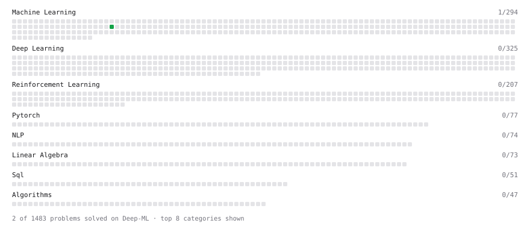

# Deep-ML

My machine learning practice from [Deep-ML](https://www.deep-ml.com). Every solution here was written by hand.

**2** solved · 2 problems · 0 labs · 0 math

[**Browse the interactive portfolio**](https://MuhammadHelmyOmar.github.io/deep-ml/) to replay this filling in over time.

## Problems

| | Difficulty | Solved | |
| --- | --- | --- | --- |
| [Linear Learning Rate Decay](https://www.deep-ml.com/problems/377) | easy | 2026-10-01 | [solution](problems/0377-linear-learning-rate-decay) |
| [Find Captain Redbeard's Hidden Treasure](https://www.deep-ml.com/problems/127) | medium | 2026-09-28 | [solution](problems/0127-find-captain-redbeard-s-hidden-treasure) |

---

_This file is regenerated by Deep-ML on every push._
